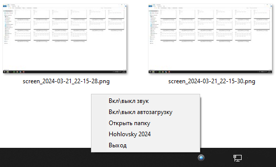

# Легкий инструмент для создания скриншотов. Small Screen Shooter.
<hr>

Просто нажмите кнопку Print Screen, и "Small Screen Shooter" автоматически сохранит скриншот в папку.
Для фанатов минимализма, только основные функции (которые также настраиваются).



## Особенности

- Простой и интуитивно понятный интерфейс
- Автоматическое сохранение скриншотов в указанной папке
- Возможность управления звуковыми уведомлениями
- Возможность включения и выключения автозагрузки приложения
- Легкий доступ к скриншотам через контекстное меню иконки в трее
- Удалите\переименуйте _screenshot.mp3_ - чтобы убрать пункт меню **звука**\
- Удалите\переименуйте _SmallScreenShooter.exe_ - уберется пункт меню **автозагрузки**


## Установка

До запуска скрипта вам необходимо установить используемые библиотеки. Установите необходимые, используя следующие команды:

```bash
    pip install requirements.txt
```

## Использование

1. Запустите, используя следующую команду:

   ```bash
   python SmallScreenShooter.py

2. Подождите, секунду, пока появится значок в трее.
3. Все, теперь при нажатии Print Screen скриншоты будут сохраняться в папке screenshots,
которая будет создана в корневой директории программы. Через трей ее можно быстро открыть. 

> советую сделать исполняемый файл(например, [тык](https://github.com/brentvollebregt/auto-py-to-exe)) чтобы можно было работать с автозагрузкой

## Лицензия

Этот проект распространяется под лицензией MIT. Подробности смотрите в файле [LICENSE](LICENSE).
